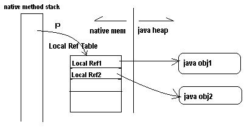
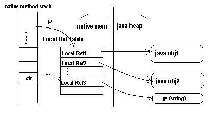
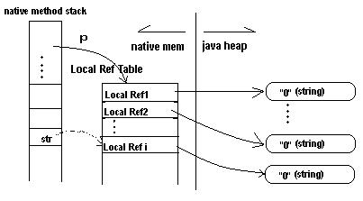
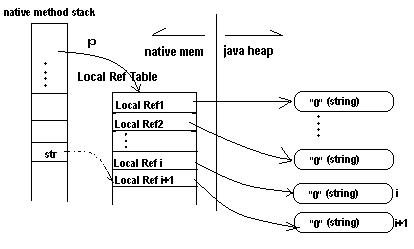

#在 JNI 编程中避免内存泄漏

##JNI 编程简介

  JNI，Java Native Interface，是 native code 的编程接口。
  JNI 使 Java 代码程序可以与 native code 交互——在 Java
  程序中调用 native code；在 native code 中嵌入 Java 虚拟机调用 Java 的代码。
  
  JNI 编程在软件开发中运用广泛，其优势可以归结为以下几点：
  
  - 利用 native code 的平台相关性，在平台相关的编程中彰显优势。
  - 对 native code 的代码重用。
  - native code 底层操作，更加高效。
  
  然而任何事物都具有两面性，JNI 编程也同样如此。程序员在使用 JNI 时应当认识到 JNI 编程中如下的几点弊端，扬长避短，
  才可以写出更加完善、高性能的代码：
  
  * 从 Java 环境到 native code 的上下文切换耗时、低效。
  * JNI 编程，如果操作不当，可能引起 Java 虚拟机的崩溃。
  * JNI 编程，如果操作不当，可能引起内存泄漏。
  
##JAVA 中的内存泄漏
  JAVA 编程中的内存泄漏，从泄漏的内存位置角度可以分为两种：
  - JVM 中 Java Heap 的内存泄漏；
  - JVM 内存中 native memory 的内存泄漏。
    
###Java Heap 的内存泄漏
   Java 对象存储在 JVM 进程空间中的 Java Heap 中，Java Heap 可以在 JVM 运行过程中动态变化。
   如果 Java 对象越来越多，占据 Java Heap 的空间也越来越大，JVM 会在运行时扩充 Java Heap 的容量。
   如果 Java Heap 容量扩充到上限，并且在 GC 后仍然没有足够空间分配新的 Java 对象，便会抛出 out of memory 异常，
   导致 JVM 进程崩溃。
   
   Java Heap 中 out of memory 异常的出现有两种原因——
   ①程序过于庞大，致使过多 Java 对象的同时存在；
   ②程序编写的错误导致 Java Heap 内存泄漏。
   
   多种原因可能导致 Java Heap 内存泄漏。JNI 编程错误也可能导致 Java Heap 的内存泄漏。
    
### JVM 中 native memory 的内存泄漏
从操作系统角度看，JVM 在运行时和其它进程没有本质区别。在系统级别上，它们具有同样的调度机制，同样的内存分配方式，同样的内存格局。

JVM 进程空间中，Java Heap 以外的内存空间称为 JVM 的 native memory。进程的很多资源都是存储在 JVM 的 native memory 中，
例如载入的代码映像，线程的堆栈，线程的管理控制块，JVM 的静态数据、全局数据等等。也包括 JNI 程序中 native code 分配到的资源。

在 JVM 运行中，多数进程资源从 native memory 中动态分配。当越来越多的资源在 native memory 中分配，
占据越来越多 native memory 空间并且达到 native memory 上限时，JVM 会抛出异常，使 JVM 进程异常退出。
而此时 Java Heap 往往还没有达到上限。

多种原因可能导致 JVM 的 native memory 内存泄漏。例如 JVM 在运行中过多的线程被创建，并且在同时运行。
JVM 为线程分配的资源就可能耗尽 native memory 的容量。

JNI 编程错误也可能导致 native memory 的内存泄漏。对这个话题的讨论是本文的重点。

### JNI 编程中明显的内存泄漏
JNI 编程实现了 native code 和 Java 程序的交互，因此 JNI 代码编程既遵循 native code 编程语言的编程规则，
同时也遵守 JNI 编程的文档规范。在内存管理方面，native code 编程语言本身的内存管理机制依然要遵循，
同时也要考虑 JNI 编程的内存管理。

本章简单概括 JNI 编程中显而易见的内存泄漏。从 native code 编程语言自身的内存管理，和 JNI 规范附加的内存管理两方面进行阐述。

#### Native Code 本身的内存泄漏
JNI 编程首先是一门具体的编程语言，或者 C 语言，或者 C++，或者汇编，或者其它 native 的编程语言。
每门编程语言环境都实现了自身的内存管理机制。因此，JNI 程序开发者要遵循 native 语言本身的内存管理机制，避免造成内存泄漏。
以 C 语言为例，当用 malloc() 在进程堆中动态分配内存时，JNI 程序在使用完后，应当调用 free() 将内存释放。
总之，所有在 native 语言编程中应当注意的内存泄漏规则，在 JNI 编程中依然适应。

Native 语言本身引入的内存泄漏会造成 native memory 的内存，严重情况下会造成 native memory 的 out of memory。

#### Global Reference 引入的内存泄漏
JNI 编程还要同时遵循 JNI 的规范标准，JVM 附加了 JNI 编程特有的内存管理机制。

JNI 中的 Local Reference 只在 native method 执行时存在，当 native method 执行完后自动失效。
这种自动失效，使得对 Local Reference 的使用相对简单，native method 执行完后，
它们所引用的 Java 对象的 reference count 会相应减 1。不会造成 Java Heap 中 Java 对象的内存泄漏。

而 Global Reference 对 Java 对象的引用一直有效，因此它们引用的 Java 对象会一直存在 Java Heap 中。
程序员在使用 Global Reference 时，需要仔细维护对 Global Reference 的使用。如果一定要使用 Global Reference，
务必确保在不用的时候删除。就像在 C 语言中，调用 malloc() 动态分配一块内存之后，调用 free() 释放一样。
否则，Global Reference 引用的 Java 对象将永远停留在 Java Heap 中，造成 Java Heap 的内存泄漏。

#### JNI 编程中潜在的内存泄漏——对 LocalReference 的深入理解

Local Reference 在 native method 执行完成后，会自动被释放，似乎不会造成任何的内存泄漏。
但这是错误的。对 Local Reference 的理解不够，会造成潜在的内存泄漏。

本章重点阐述 Local Reference 使用不当可能引发的内存泄漏。引入两个错误实例，也是 JNI 程序员容易忽视的错误；
在此基础上介绍 Local Reference 表，对比 native method 中的局部变量和 JNI Local Reference 的不同，
使读者深入理解 JNI Local Reference 的实质；最后为 JNI 程序员提出应该如何正确合理使用 JNI Local Reference，以避免内存泄漏。

##### 错误实例 1
在某些情况下，我们可能需要在 native method 里面创建大量的 JNI Local Reference。这样可能导致 native memory 的内存泄漏，
如果在 native method 返回之前 native memory 已经被用光，就会导致 native memory 的 out of memory。

在代码清单 1 里，我们循环执行 count 次，JNI function NewStringUTF() 在每次循环中从 Java Heap 中创建一个 String 对象，
str 是 Java Heap 传给 JNI native method 的 Local Reference，每次循环中新创建的 String 对象覆盖上次循环中 str 的内容。
str 似乎一直在引用到一个 String 对象。整个运行过程中，我们看似只创建一个 Local Reference。

执行代码清单 1 的程序，第一部分为 Java 代码，nativeMethod(int i) 中，输入参数设定循环的次数。
第二部分为 JNI 代码，用 C 语言实现了 nativeMethod(int i)。    

清单 1. Local Reference 引发内存泄漏
<pre>
Java 代码部分
 class TestLocalReference { 
 private native void nativeMethod(int i); 
 public static void main(String args[]) { 
         TestLocalReference c = new TestLocalReference(); 
         //call the jni native method 
         c.nativeMethod(1000000); 
 }  
 static { 
 //load the jni library 
 System.loadLibrary("StaticMethodCall"); 
 } 
 } 
 
 JNI 代码，nativeMethod(int i) 的 C 语言实现
 #include<stdio.h> 
 #include<jni.h> 
 #include"TestLocalReference.h"
 JNIEXPORT void JNICALL Java_TestLocalReference_nativeMethod 
 (JNIEnv * env, jobject obj, jint count) 
 { 
 jint i = 0; 
 jstring str; 
 
 for(; i<count; i++) 
         str = (*env)->NewStringUTF(env, "0"); 
 } 
运行结果
 JVMCI161: FATAL ERROR in native method: Out of memory when expanding 
 local ref table beyond capacity 
 at TestLocalReference.nativeMethod(Native Method) 
 at TestLocalReference.main(TestLocalReference.java:9)
</pre>

运行结果证明，JVM 运行异常终止，原因是创建了过多的 Local Reference，从而导致 out of memory。
实际上，nativeMethod 在运行中创建了越来越多的 JNI Local Reference，而不是看似的始终只有一个。
过多的 Local Reference，导致了 JNI 内部的 JNI Local Reference 表内存溢出。

##### 错误实例 2
实例 2 是实例 1 的变种，Java 代码未作修改，但是 nativeMethod(int i) 的 C 语言实现稍作修改。
在 JNI 的 native method 中实现的 utility 函数中创建 Java 的 String 对象。
utility 函数只建立一个 String 对象，返回给调用函数，但是 utility 函数对调用者的使用情况是未知的，
每个函数都可能调用它，并且同一函数可能调用它多次。在实例 2 中，nativeMethod 在循环中调用 count 次，
utility 函数在创建一个 String 对象后即返回，并且会有一个退栈过程，似乎所创建的 Local Reference 会在退栈时被删除掉，
所以应该不会有很多 Local Reference 被创建。实际运行结果并非如此。

清单 2. Local Reference 引发内存泄漏
<pre>
Java 代码部分参考实例 1，未做任何修改。
 
 JNI 代码，nativeMethod(int i) 的 C 语言实现
 #include<stdio.h> 
 #include<jni.h> 
 #include"TestLocalReference.h"
 jstring CreateStringUTF(JNIEnv * env) 
 { 
 return (*env)->NewStringUTF(env, "0"); 
 } 
 JNIEXPORT void JNICALL Java_TestLocalReference_nativeMethod 
 (JNIEnv * env, jobject obj, jint count) 
 { 
 jint i = 0; 
 for(; i<count; i++) 
 { 
         str = CreateStringUTF(env); 
 } 
 } 
运行结果
 JVMCI161: FATAL ERROR in native method: Out of memory when expanding local ref 
 table beyond  capacity 
 at TestLocalReference.nativeMethod(Native Method) 
 at TestLocalReference.main(TestLocalReference.java:9)
 
</pre>

运行结果证明，实例 2 的结果与实例 1 的完全相同。过多的 Local Reference 被创建，
仍然导致了 JNI 内部的 JNI Local Reference 表内存溢出。实际上，在 utility 函数 CreateStringUTF(JNIEnv * env)

执行完成后的退栈过程中，创建的 Local Reference 并没有像 native code 中的局部变量那样被删除，
而是继续在 Local Reference 表中存在，并且有效。Local Reference 和局部变量有着本质的区别。

#### Local Reference 深层解析
Java JNI 的文档规范只描述了 JNI Local Reference 是什么（存在的目的），以及应该怎么使用 Local Reference（开放的接口规范）。
但是对 Java 虚拟机中 JNI Local Reference 的实现并没有约束，不同的 Java 虚拟机有不同的实现机制。
这样的好处是，不依赖于具体的 JVM 实现，有好的可移植性；并且开发简单，规定了“应该怎么做、怎么用”。
但是弊端是初级开发者往往看不到本质，“不知道为什么这样做”。对 Local Reference 没有深层的理解，就会在编程过程中无意识的犯错。

##### Local Reference 和 Local Reference 表

理解 Local Reference 表的存在是理解 JNI Local Reference 的关键。

JNI Local Reference 的生命期是在 native method 的执行期（从 Java 程序切换到 native code 环境时开始创建，
或者在 native method 执行时调用 JNI function 创建），在 native method 执行完毕切换回 Java 程序时，
所有 JNI Local Reference 被删除，生命期结束（调用 JNI function 可以提前结束其生命期）。

实际上，每当线程从 Java 环境切换到 native code 上下文时（J2N），JVM 会分配一块内存，
创建一个 Local Reference 表，这个表用来存放本次 native method 执行中创建的所有的 Local Reference。
每当在 native code 中引用到一个 Java 对象时，JVM 就会在这个表中创建一个 Local Reference。
比如，实例 1 中我们调用 NewStringUTF() 在 Java Heap 中创建一个 String 对象后，在 Local Reference 
表中就会相应新增一个 Local Reference。

图 1. Local Reference 表、Local Reference 和 Java 对象的关系

 
 
 
 -⑴运行 native method 的线程的堆栈记录着 Local Reference 表的内存位置（指针 p）。

 -⑵ Local Reference 表中存放 JNI Local Reference，实现 Local Reference 到 Java 对象的映射。
 
 -⑶ native method 代码间接访问 Java 对象（java obj1，java obj2）。
 通过指针 p 定位相应的 Local Reference 的位置，然后通过相应的 Local Reference 映射到 Java 对象。
 
 -⑷当 native method 引用一个 Java 对象时，会在 Local Reference 表中创建一个新 Local Reference。
 在 Local Reference 结构中写入内容，实现 Local Reference 到 Java 对象的映射。
 
 -⑸ native method 调用 DeleteLocalRef() 释放某个 JNI Local Reference 时，
 首先通过指针 p 定位相应的 Local Reference 在 Local Ref 表中的位置，然后从 Local Ref 表中删除该 Local Reference，
 也就取消了对相应 Java 对象的引用（Ref count 减 1）。
 
 -⑹当越来越多的 Local Reference 被创建，这些 Local Reference 会在 Local Ref 表中占据越来越多内存。
 当 Local Reference 太多以至于 Local Ref 表的空间被用光，JVM 会抛出异常，从而导致 JVM 的崩溃。
 
 
 ##### Local Ref 不是 native code 的局部变量
 
 很多人会误将 JNI 中的 Local Reference 理解为 Native Code 的局部变量。这是错误的。
 
 Native Code 的局部变量和 Local Reference 是完全不同的，区别可以总结为：
 
 -⑴局部变量存储在线程堆栈中，而 Local Reference 存储在 Local Ref 表中。
 
 -⑵局部变量在函数退栈后被删除，而 Local Reference 在调用 DeleteLocalRef() 后才会从 Local Ref 表中删除，并且失效，
 或者在整个 Native Method 执行结束后被删除。
 
 -⑶可以在代码中直接访问局部变量，而 Local Reference 的内容无法在代码中直接访问，必须通过 JNI function 间接访问。
 
 JNI function 实现了对 Local Reference 的间接访问，JNI function 的内部实现依赖于具体 JVM。
 
 代码清单 1 中 str = (*env)->NewStringUTF(env, "0");
 
 str 是 jstring 类型的局部变量。Local Ref 表中会新创建一个 Local Reference，引用到 NewStringUTF(env, "0")
  在 Java Heap 中新建的 String 对象。如图 2 所示：
 
 图 2. str 间接引用 string 对象
 
  
  
  图 2 中，str 是局部变量，在 native method 堆栈中。Local Ref3 是新创建的 Local Reference，
  在 Local Ref 表中，引用新创建的 String 对象。JNI 通过 str 和指针 p 间接定位 Local Ref3，但 p 和 Local Ref3 对 JNI 程序员不可见。
  
  Local Reference 导致内存泄漏
  
  在以上论述基础上，我们通过分析错误实例 1 和实例 2，来分析 Local Reference 可能导致的内存泄漏，
  加深对 Local Reference 的深层理解。
  
  分析错误实例 1：
  
  局部变量 str 在每次循环中都被重新赋值，间接指向最新创建的 Local Reference，前面创建的 Local Reference 一直保留在 Local Ref 表中。
  
  在实例 1 执行完第 i 次循环后，内存布局如图 3：
  
  图 3. 执行 i 次循环后的内存布局
  
  
  
 
 继续执行完第 i+1 次循环后，内存布局发生变化，如图 4：
 
 图 4. 执行 i+1 次循环后的内存布局
 
  
  
  图 4 中，局部变量 str 被赋新值，间接指向了 Local Ref i+1。在 native method 运行过程中，我们已经无法释放 Local Ref i 占用的内存，以及 Local Ref i 所引用的第 i 个 string 对象所占据的 Java Heap 内存。所以，native memory 中 Local Ref i 被泄漏，Java Heap 中创建的第 i 个 string 对象被泄漏了。
  
  也就是说在循环中，前面创建的所有 i 个 Local Reference 都泄漏了 native memory 的内存，创建的所有 i 个 string 对象都泄漏了 Java Heap 的内存。
  
  直到 native memory 执行完毕，返回到 Java 程序时（N2J），这些泄漏的内存才会被释放，但是 Local Reference 表所分配到的内存往往很小，在很多情况下 N2J 之前可能已经引发严重内存泄漏，导致 Local Reference 表的内存耗尽，使 JVM 崩溃，例如错误实例 1。
  
  
  ####### 分析错误实例 2：
  
  实例 2 与实例 1 相似，虽然每次循环中调用工具函数 CreateStringUTF(env) 来创建对象，但是在 CreateStringUTF(env) 返回退栈过程中，只是局部变量被删除，而每次调用创建的 Local Reference 仍然存在 Local Ref 表中，并且有效引用到每个新创建的 string 对象。str 局部变量在每次循环中被赋新值。
  
  这样的内存泄漏是潜在的，但是这样的错误在 JNI 程序员编程过程中却经常出现。通常情况，在触发 out of memory 之前，native method 已经执行完毕，切换回 Java 环境，所有 Local Reference 被删除，问题也就没有显露出来。但是某些情况下就会引发 out of memory，导致实例 1 和实例 2 中的 JVM 崩溃。
  
  ### 控制 Local Reference 生命期
  因此，在 JNI 编程时，正确控制 JNI Local Reference 的生命期。如果需要创建过多的 Local Reference，那么在对被引用的 Java 对象操作结束后，需要调用 JNI function（如 DeleteLocalRef()），及时将 JNI Local Reference 从 Local Ref 表中删除，以避免潜在的内存泄漏。
  
  ##总结
  本文阐述了 JNI 编程可能引发的内存泄漏，JNI 编程既可能引发 Java Heap 的内存泄漏，也可能引发 native memory 的内存泄漏，严重的情况可能使 JVM 运行异常终止。JNI 软件开发人员在编程中，应当考虑以下几点，避免内存泄漏：
  
  native code 本身的内存管理机制依然要遵循。
  使用 Global reference 时，当 native code 不再需要访问 Global reference 时，应当调用 JNI 函数 DeleteGlobalRef() 删除 Global reference 和它引用的 Java 对象。Global reference 管理不当会导致 Java Heap 的内存泄漏。
  透彻理解 Local reference，区分 Local reference 和 native code 的局部变量，避免混淆两者所引起的 native memory 的内存泄漏。
  使用 Local reference 时，如果 Local reference 引用了大的 Java 对象，当不再需要访问 Local reference 时，应当调用 JNI 函数 DeleteLocalRef() 删除 Local reference，从而也断开对 Java 对象的引用。这样可以避免 Java Heap 的 out of memory。
  使用 Local reference 时，如果在 native method 执行期间会创建大量的 Local reference，当不再需要访问 Local reference 时，应当调用 JNI 函数 DeleteLocalRef() 删除 Local reference。Local reference 表空间有限，这样可以避免 Local reference 表的内存溢出，避免 native memory 的 out of memory。
  严格遵循 Java JNI 规范书中的使用规则。
  